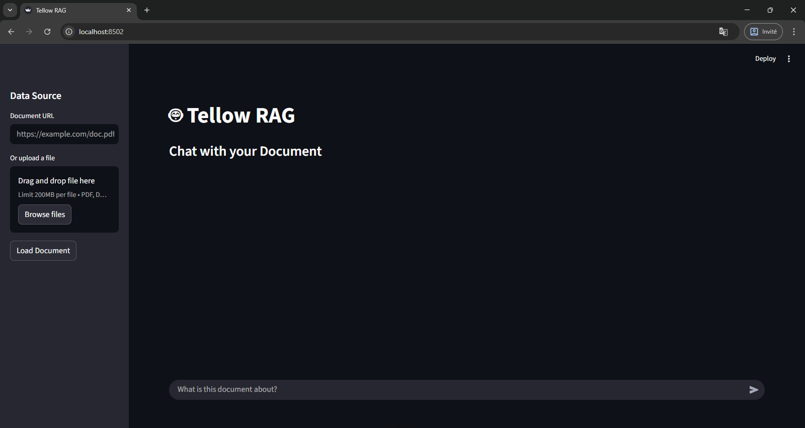

# Tellow RAG 🤖

A modern Retrieval-Augmented Generation (RAG) system built with **Python**, **LangChain**, and **Streamlit**. Tellow RAG uses **Docling** for powerful document parsing (supporting PDFs, Office documents, and even Audio/Video) and **LanceDB** for efficient vector storage.



## ✨ Features

-   **Modular RAG Architecture**: Built with LangChain and LanceDB.
-   **Universal Document Support**: Powered by [Docling](https://github.com/DS4SD/docling).
    -   📄 **Documents**: PDF, DOCX, PPTX, XLSX, HTML, TXT, MD.
    -   🖼️ **Images**: PNG, JPG, JPEG, TIFF, BMP.
    -   🎙️ **Audio/Video** (Requires Python 3.13): MP3, WAV, VTT (via OpenAI Whisper).
-   **Interactive UI**: Clean Streamlit interface with chat history and intuitive file uploading.
-   **Persistent Embeddings**: Uses OpenAI embeddings stored locally in LanceDB.

## 🛠️ Installation

### Prerequisites
-   **Python 3.13** (Recommended for Whisper/Audio support).
    -   *Note*: Python 3.14 may have compatibility issues with some dependencies like Whisper.
-   **OpenAI API Key**.

### Setup
1.  **Clone the repository**:
    ```bash
    git clone https://github.com/user257814938/Tellow_RAG.git
    cd Tellow_RAG
    ```

2.  **Install Dependencies**:
    *It is recommended to use a virtual environment.*
    ```bash
    # Using Python 3.13 specific launcher if you have multiple versions
    py -3.13 -m pip install -r requirements.txt
    ```

3.  **Configuration**:
    Create a `.env` file in the root directory (use `.env.example` as a template):
    ```env
    OPENAI_API_KEY=sk-proj-your-api-key-here
    ```

## 🚀 Usage

### Running the Web App
Run the Streamlit app using Python 3.13:
```bash
py -3.13 -m streamlit run app.py
```

### Using the App
1.  **Upload**: drag & drop a file (PDF, DOCX, MP3, etc.) or enter a Document URL in the sidebar.
2.  **Load**: Click **"Load Document"**. The system will parse and index the content.
3.  **Chat**: Ask questions about the uploaded content in the main chat window.

## 🏗️ Project Structure

-   `app.py`: Streamlit web application entry point.
-   `main.py`: Command-line interface (CLI) for testing.
-   `rag_system.py`: Core RAG logic (Document loading, Docling integration, Vector Store).
-   `config.py`: Centralized configuration.
-   `requirements.txt`: Python dependencies.
-   `lancedb/`: Local vector database storage (created automatically).

## ⚠️ Troubleshooting

-   **Import Errors**: Ensure you are running with the correct Python version (`py -3.13`).
-   **Audio Transcription**: Ensure `openai-whisper` is installed and you are on Python 3.13.
